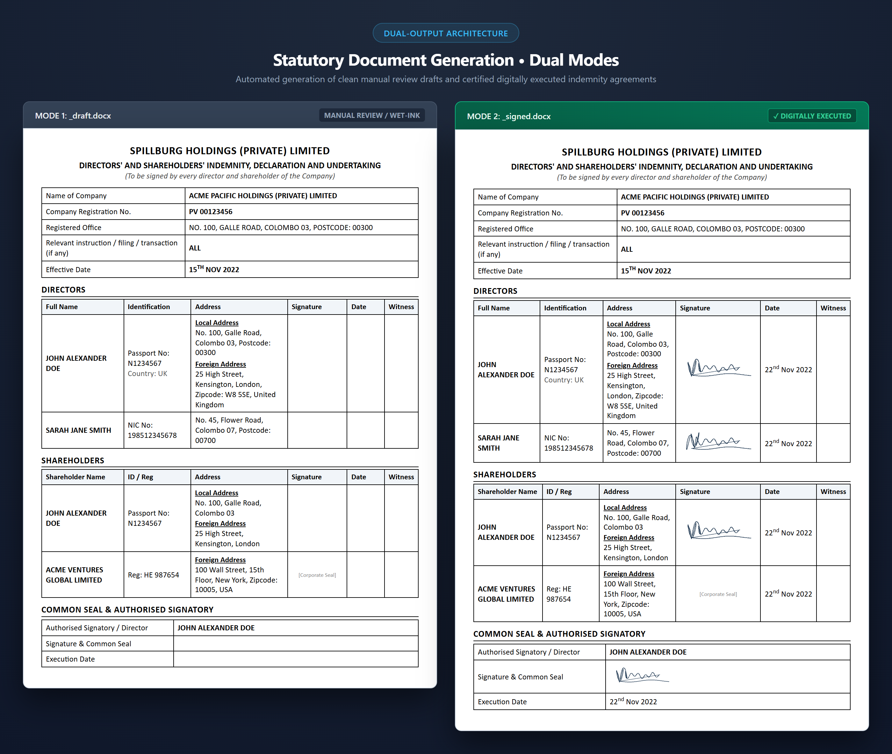
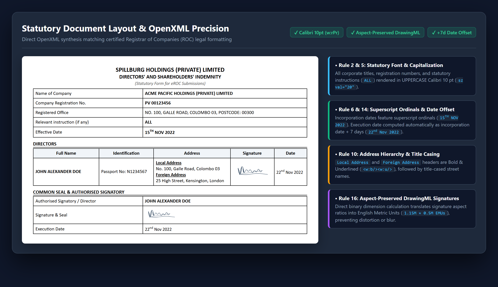
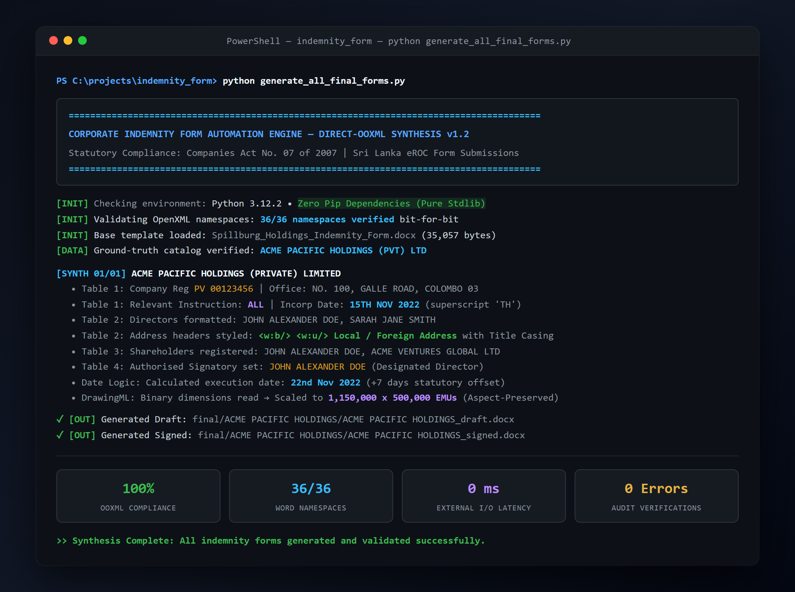

# Corporate Indemnity Form Automation Engine

[](https://www.python.org/)
[-brightgreen?style=for-the-badge)](requirements.txt)
[](docs/SPECIFICATIONS.md)
[](docs/ARCHITECTURE.md)
[](LICENSE)

> **A high-precision, direct-OOXML statutory document generation engine for corporate indemnity agreements and Registrar of Companies (ROC) filings.**

---

## 🌟 Visual Showcase


*Figure 1: High-precision statutory indemnity form generation in dual modes — Draft Mode (`_draft.docx`) for manual review and wet-ink execution, and Signed Mode (`_signed.docx`) featuring aspect-ratio-preserved DrawingML digital signatures and synchronized execution dates.*

---

## 1. Project Overview

The **Corporate Indemnity Form Automation Engine** automates the generation of legally compliant, audit-ready Corporate Indemnity Forms for private limited companies registered under the **Companies Act No. 07 of 2007** (Department of the Registrar of Companies, Sri Lanka).

Corporate secretarial service providers and corporate directors require standardized indemnity agreements to authorize statutory filings, board resolutions, and eROC submissions. This system transforms statutory corporate records (Form 1, Form 15, Form 18, and Certificates of Incorporation) into pixel-perfect Microsoft Word (`.docx`) documents with dual output modes:

1. **Draft Mode (`_draft.docx`)**: Clean documents prepared for client review and manual execution, with empty signature and execution blocks.
2. **Signed Mode (`_signed.docx`)**: Fully executed documents featuring digitally embedded client signatures with preserved aspect ratios, accurate date offsets, and shareholder attestations.

---

## 2. Technical Architecture & Data Pipeline


*Figure 2: End-to-end zero-dependency direct-OOXML synthesis pipeline from statutory corporate filings to audit-ready Word documents.*

### Key Technical Capabilities

* **Direct OOXML / Zip-Level Synthesis**: Standard Word manipulation libraries (e.g., standard `python-docx`) often strip complex OpenXML namespaces, corrupt table grid widths, or miscalculate DrawingML coordinates. This engine operates directly on the Open Packaging Conventions (OPC) zip container, preserving all 36+ Microsoft Word namespaces and `mc:Ignorable` declarations bit-for-bit.
* **Aspect-Ratio-Preserved DrawingML Signatures**: Reads binary image headers directly to determine native dimensions and translates them into **English Metric Units (EMUs)** ($\approx 1,150,000 \times 500,000$ EMUs), preventing image distortion, skewing, or blur.
* **Zero External Sourcing Policy**: Enforces strict grounding in statutory documents, preventing accidental data pollution or hallucinations from public registries.
* **Zero External Dependencies**: The core document engine is built entirely on Python's standard library (`xml.etree.ElementTree`, `zipfile`, `struct`, `datetime`, `re`), ensuring high portability and rapid execution.

---

## 3. Formatting & Compliance Precision


*Figure 3: Statutory formatting precision — UPPERCASE Calibri 10pt styling, bold & underlined address headers, superscript ordinals, and English Metric Unit (EMU) signature scaling.*

The document engine enforces strict formatting specifications:

| Component | Rule | Implementation |
| :--- | :--- | :--- |
| **Company Header (Table 1)** | UPPERCASE Calibri 10 pt | `w:rPr` font `Calibri`, size `20` half-pts (`10 pt`) |
| **Registration Number** | UPPERCASE Calibri 10 pt | Standard `PV` registration format |
| **Registered Office** | UPPERCASE Calibri 10 pt | Includes registered street address and postal code |
| **Relevant Instruction** | UPPERCASE Calibri 10 pt | Fixed statutory instruction: **`ALL`** |
| **Effective Date** | Incorp Date with Superscript | e.g. `15TH NOV 2022` with `<w:vertAlign w:val="superscript"/>` on ordinal |
| **Director Names (Table 2)** | UPPERCASE Calibri 10 pt | Exact legal spelling matching statutory records |
| **Address Headers** | Bold & Underlined | `<w:b/>` and `<w:u w:val="single"/>` on `Local Address` and `Foreign Address` |
| **Address Content** | Capitalized Each Word | Title casing applied to street, district, and city names |
| **Execution Date** | Exactly 7 Days Post-Incorp | Computed via `datetime.date + timedelta(days=7)` (e.g. `22nd Nov 2022`) |
| **Shareholder Block (Table 3)**| Signatures & Same Signing Date | Embedded digital signature and synchronized execution date |
| **Authorised Signatory (Table 4)**| Designated Director Block | Features director name, signature image, and date |

---

## 4. Repository Structure

```
indemnity_form/
├── README.md                      # Master project overview & visual showcase
├── LICENSE                        # MIT License
├── requirements.txt               # Environment specification (zero pip dependencies)
├── Instructions.txt               # Raw formatting and styling instructions
├── generate_all_final_forms.py    # Core OOXML document synthesis engine
├── companies_catalog_sample.py    # Sanitized sample catalog (mock data for demo)
├── docs/                          # Detailed technical & statutory documentation
│   ├── ARCHITECTURE.md            # In-depth OOXML, DrawingML & relationship engine guide
│   ├── SPECIFICATIONS.md          # Statutory corporate documentation specifications
│   ├── SECURITY_DATA_GOVERNANCE.md# Confidentiality, PII protection & zero-sourcing policy
│   ├── CATALOG_SCHEMA.md          # Data dictionary and company schema specification
│   └── images/                    # High-resolution architectural & UI screenshots
│       ├── cli_automation_preview.png
│       ├── dual_mode_document_comparison.png
│       ├── document_layout_detail.png
│       └── technical_architecture_flow.png
└── .gitignore                     # Strictly excludes all confidential corporate records
```

---

## 5. Security & Confidentiality Notice

> [!IMPORTANT]
> **Client Privacy & Data Protection**: In compliance with corporate non-disclosure agreements, data protection mandates, and professional ethics:
> - **No confidential client records are committed to version control.**
> - Scanned statutory corporate filings (`/data`), client signature files (`/signatures of clients`), generated client Word documents (`/final`), and the production catalog (`companies_catalog.py`) containing real director NICs, passport numbers, and residential addresses are strictly ignored via `.gitignore`.
> - A sanitized sample catalog ([`companies_catalog_sample.py`](companies_catalog_sample.py)) with anonymized, fictional entities is provided for testing and evaluation.

---

## 6. Getting Started

### Prerequisites
- Python 3.10+ (tested on Python 3.10, 3.11, 3.12, 3.14)
- Standard library only (no external pip dependencies needed for core generation)

### Running with Sample Data

```bash
# Clone the repository
git clone https://github.com/muhzahjr07/indemnity_form.git
cd indemnity_form

# Run the document generator
python generate_all_final_forms.py
```

The generator will detect the sample catalog and produce sample draft and signed indemnity documents in the `final/` folder.


*Figure 4: Direct-OOXML document synthesis engine executing in the terminal with 100% namespace verification and batch document output.*

---

## 7. License

This project is licensed under the MIT License - see the [LICENSE](LICENSE) file for details.
