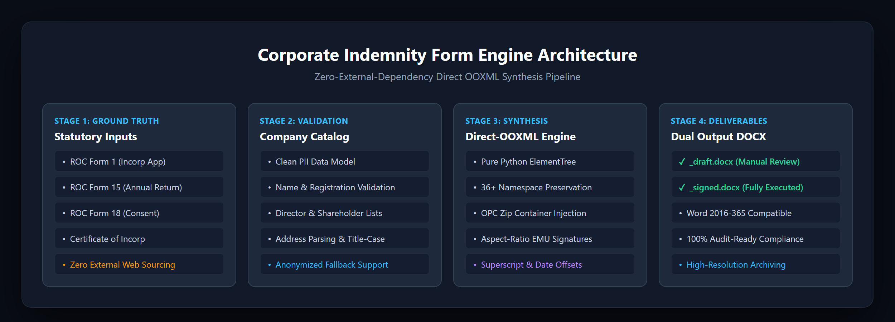

# Technical Architecture: Corporate Indemnity Form Generator

## 1. System Overview

The **Corporate Indemnity Form Automation Engine** generates legally compliant, production-grade indemnity documentation for private limited companies.

Traditional document manipulation tools (such as standard python-docx wrappers) frequently strip OpenXML namespaces, distort embedded table dimensions, miscalculate EMUs for image drawings, or invalidate relationship graphs. This system uses direct **OOXML (Open Packaging Conventions)** synthesis via Python's standard library to achieve exact, bit-level layout fidelity.



```
                    +---------------------------+
                    |    Statutory Document     |
                    |  (Form 1, 15, 18 Scans)   |
                    +-------------+-------------+
                                  |
                                  v
                    +---------------------------+
                    |     Verified Ground-      |
                    |       Truth Catalog       |
                    +-------------+-------------+
                                  |
                                  v
+------------------+     +-------------------+     +---------------------+
|  Base Word XML   | --> |  Document Engine  | --> |  Generated Forms    |
|  Template (.docx)|     |  Direct OOXML Zip |     |  - <Name>_draft.docx|
+------------------+     +-------------------+     |  - <Name>_signed.docx
                                  ^                +---------------------+
                                  |
                    +-------------+-------------+
                    |  Client Signature Assets  |
                    |   (Aspect Ratio & EMU)    |
                    +---------------------------+
```

---

## 2. Direct OOXML & XML Processing Engine

### 2.1 Namespace Preservation
A `.docx` file is a ZIP archive containing WordprocessingML XML files. Microsoft Word utilizes over 30 namespaces (e.g. `w:`, `w14:`, `w15:`, `r:`, `wp:`, `a:`, `pic:`) alongside markup compatibility attributes (`mc:Ignorable`).
When standard XML parsers parse and reserialize `word/document.xml`, default namespace prefixes can be stripped or mangled, causing Word to trigger repair warnings upon opening.

The engine preserves the exact root element attributes and declared namespaces:
```python
orig_doc_bytes = file_map['word/document.xml']
orig_header = orig_doc_bytes[:orig_doc_bytes.find(b'<w:body>')]
# Ensure drawingML and relationship namespaces exist
# Re-serialize body while keeping the bit-for-bit pristine root header
```

### 2.2 Table Manipulation & Dynamic Grid Alignment
The document template contains 4 core tables:
1. **Table 1 (`tbl1`)**: Corporate Identification Header (Company Name, Registration No, Registered Office, Scope of Instruction, Effective Date).
2. **Table 2 (`tbl2`)**: Directors Schedule (Full Name, Identification Lines, Address Lines, Signature, Signing Date, Witness).
3. **Table 3 (`tbl3`)**: Shareholders Schedule (Full Name, Identification, Address, Signature, Signed Date, Witness).
4. **Table 4 (`tbl4`)**: Execution & Common Seal Block (Authorised Signatory, Signature & Date, Corporate Seal placeholder).

The engine dynamically clears existing template rows and builds new rows with cell width allocations in **DXA** (1 inch = 1440 DXA):
- Column 1 (Name): `1644 dxa`
- Column 2 (ID): `1563 dxa`
- Column 3 (Address): `1626 dxa`
- Column 4 (Signature): `2060 dxa`
- Column 5 (Date): `1656 dxa`
- Column 6 (Witness): `1656 dxa`

---

## 3. Signature Rendering & DrawingML Injection

### 3.1 EMU Calculation & Aspect Ratio Preservation
Signatures are rendered in Word via DrawingML inline elements (`<wp:inline>`). Coordinates and dimensions in DrawingML are measured in **EMUs (English Metric Units)**, where:
$$1\text{ inch} = 914,400\text{ EMUs}$$
$$1\text{ cm} = 360,000\text{ EMUs}$$

To avoid stretched, squashed, or unrealistic signatures:
1. The engine reads native pixel dimensions from JPEG/PNG headers (`SOF0` markers for JPEG, `IHDR` for PNG) using binary byte inspection.
2. An optimal bounding box is targeted ($\approx 1,150,000\text{ EMUs} \times 500,000\text{ EMUs}$).
3. The exact aspect ratio is computed:
   $$c_x = \text{target\_max\_width}$$
   $$c_y = \text{round}(c_x / \text{aspect})$$
   $$\text{if } c_y > \text{target\_max\_height: } c_y = \text{target\_max\_height}, c_x = \text{round}(c_y \times \text{aspect})$$

### 3.2 Relationship Mapping (`_rels/document.xml.rels`)
For each signature:
1. The image is added to `word/media/image{N}.{ext}` inside the zip archive.
2. A relationship is declared in `word/_rels/document.xml.rels`:
   ```xml
   <Relationship Id="rId{N}"
                 Type="http://schemas.openxmlformats.org/officeDocument/2006/relationships/image"
                 Target="media/image{N}.jpeg"/>
   ```
3. `[Content_Types].xml` is updated to register default MIME types (`image/jpeg`, `image/png`).
4. The inline DrawingML blip references `r:embed="rId{N}"`.

---

## 4. Typography & Layout Specifications

All text runs are built with exact styling tokens:
- **Font**: Calibri (`ascii="Calibri"`, `hAnsi="Calibri"`, `cs="Calibri"`)
- **Size**: 10 pt (`sz="20"`, `szCs="20"` in half-points)
- **Superscript Runs**: Vertical alignment attribute `<w:vertAlign w:val="superscript"/>` on ordinal suffixes (`15TH NOV 2022`).
- **Address Formatting**: Title headers (`Local Address`, `Foreign Address`) receive bold `<w:b/>` and single underline `<w:u w:val="single"/>`, while address lines feature title casing.
